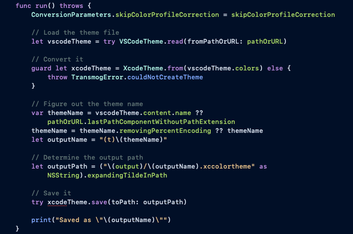
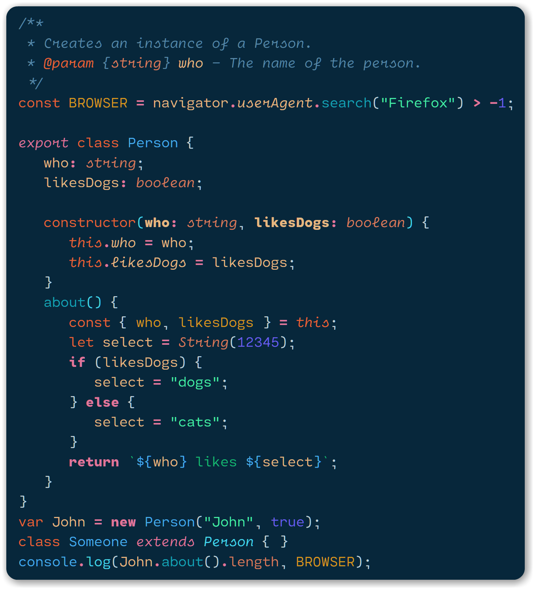

# Transmog

Transmog is a command-line tool for converting Visual Studio Code (VSCode) themes into Xcode themes.

## Install

```sh
brew install mint
mint install inket/Transmog
```

## Usage

Using a local theme:

```sh
$ transmog theme-file.json
Saved as "(t)Theme Name"
```

Or from a URL:

```sh
$ transmog https://github.com/liviuschera/noctis/blob/master/themes/azureus.json
Saved as "(t)Noctis Azureus"
```

## A few examples

#### [HackTheBox](https://github.com/silofy/hackthebox)

Original                   | Transmog
:-------------------------:|:-------------------------:
  |  

#### [Night Owl](https://github.com/sdras/night-owl-vscode-theme)

Original                   | Transmog
:-------------------------:|:-------------------------:
   |  

#### [Noctis (Azureus)](https://github.com/liviuschera/noctis)

Original                   | Transmog
:-------------------------:|:-------------------------:
   |  

#### [Tokyo Night](https://github.com/enkia/tokyo-night-vscode-theme)

Original                   | Transmog
:-------------------------:|:-------------------------:
   |  

## Considerations

Obviously the result theme will not match 1:1 because IDEs parse code differently.

In addition, VSCode allows for much more complex themes that are language/framework-aware so a specific theme might look different when rendering JS code vs TypeScript code.

This tool will only convert the colors that aren't associated with a specific language.

In my testing, the results are decent, but you might need to edit the theme to reach perfection ;)

## Help

```
OVERVIEW: A command-line tool for converting VSCode themes files into Xcode theme files

USAGE: transmog <theme-file-path-or-url> [--output <output>] [--skip-color-profile-correction]

ARGUMENTS:
  <theme-file-path-or-url>
                          Path or URL of the VSCode theme file (.json). GitHub links are also supported. 

OPTIONS:
  -o, --output <output>   Output directory path (optional) (default:
                          ~/Library/Developer/Xcode/UserData/FontAndColorThemes/)
  -s, --skip-color-profile-correction
                          Skip the color profile correction of VSCode theme values.
                          This will cause theme colors to look different in Xcode from what they appear like in
                          VSCode. 
  -h, --help              Show help information.
```
